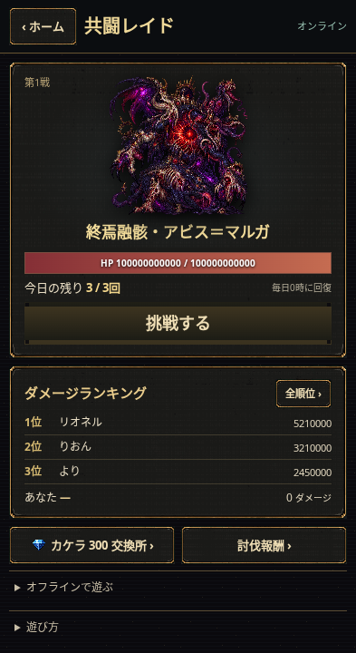
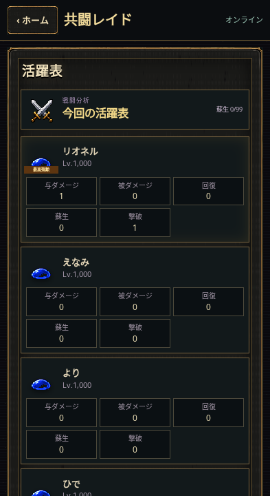
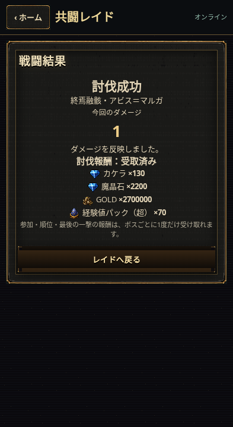

# Build432 / v3.1.111 — 共闘レイドの画面整理

ホーム左の「共闘レイド」から、現在のボス・共有HP・残り挑戦回数・上位3人と自分の順位・カケラ交換への入口をまとめて確認できます。既存の黒と金の枠素材を使用し、オフライン用の詳しい操作は「オフラインで遊ぶ」に折りたたみました。交換所では3体分の仲間・武器・魔法陣を切り替えて交換できます。

「挑戦する」からは第一章・第二章でも使用している `BattleScreen` に進みます。大きな待機説明を外し、終了後は同じ活躍表から報酬確認へ進みます。討伐報酬が未確定の場合はその状態を表示します。画面は縦スクロールでき、下端の安全領域に余白を確保しています。

## 敵の編成

| ボス | Lv100の子分 | 本体だけの専用魔法陣 |
| --- | --- | --- |
| 終焉融骸・アビス＝マルガ | 既存の融合幼体2体 | 輪廻の魔法陣 |
| 零界凍皇・ニヴル＝レギア | フロストコア2体 | 零界凍結陣 |
| 雷獄天獣・ヴァジュリオン | スパークコア2体 | 天雷轟界陣 |

専用魔法陣は既存交換品のLv1効果と一致します。輪廻は共有ボスにつき1回HP70%で復活、凍結陣は最大HP100%の共有障壁、天雷轟界陣は被弾による威力上昇・追撃です。子分と味方の魔法陣には適用しません。最初の5ラウンドの本体待機、全10ラウンド、1日3回は従来どおりです。

新しく保存するオフライン挑戦は `ruleVersion: 2`。すでに発行された `ruleVersion: 1` は固定済みの `runtime430` で再計算します。旧チケットの内容は書き換えません。進行中のオンライン挑戦はID・ダメージ・消費回数を保って再開できます。

## ZIPの上書き手順

このZIPは、Build424以降の既存ゲームへ上書きする累積更新版です。Build431までの更新と、今回のBuild432をまとめています。各Buildを順番に入れ直す必要はありません。元のゲーム一式・既存画像は必要です。

1. 起動中のオンラインサーバーを停止し、ゲームのセーブと既存のサーバー `data` フォルダーをバックアップします。
2. ZIPを解凍し、中身をすべて、`index.html` がある既存ゲームのフォルダーへコピーします。同名ファイルは「置き換える」を選びます。既存フォルダーを丸ごと削除しないでください。
3. いつもGitHub Desktopで公開している場合は、上書きによる変更をコミットしてPushします。今回作ったGitHubの修正案を操作する必要はありません。
4. サーバー側が別の場所にある場合は、`online-server/` と、その隣の `src/` も同じ更新内容にそろえ、いつもと同じ設定でサーバーを再起動します。追加パッケージは不要です。
5. ゲームを再読み込みし、表示が **v3.1.111** になったことを確認します。

**既存の `data/` と環境設定は、そのまま残してください。** ボスHP・残り回数・未送信の結果・受取記録を保持します。このZIPには利用者の保存データや環境設定を含めていません。

ルートの `world-raid-offline432-sw.js` と `world-raid-offline432-assets.json` も同梱しています。フォルダー構成を変えず、中身をまとめて上書きしてください。

セーブ形式はschema 84を継続します。更新処理は新しいService Workerの有効化を待ってから起動し、セーブ・取得済み挑戦・未送信結果・報酬の受取記録を保持します。交換の保存失敗時は、カケラ・交換品・交換記録をまとめて戻します。

## 検証

- 関連する自動テスト **96件成功**。実サーバーの処理、実SaveService、保存失敗と再試行、再接続、3回制限、遅延送信、重複報酬防止、新旧チケットの再現、更新時のキャッシュ切替を確認しました。
- ChromiumとローカルWebSocketサーバーで、393×720・375×620・1280×800の主要情報表示を確認しました。ロビー・全順位・交換所・戦闘・活躍表の末尾へスクロールでき、挑戦→手動操作→活躍表→報酬→ロビーの操作が完了しました。JavaScript例外・画像などの404は0件です。
- `BattleScreen.js`、既存画像、発行済みチケット用 `runtime430` は変更していません。
- 実機iPhone Safari、実際の機内モード切替、本番サーバーへの接続・公開反映は未確認です。画像はローカルの確認用データによる表示です。

全履歴テストの一括実行は、旧テストが外部ngrokトンネルへ接続するため自動承認レビューで停止しました。その実行は再試行せず、外部へ接続しない上記の関連96件とローカルブラウザー検証を実施しています。全履歴テストの成功を示すものではありません。

ログ: [tests.log](docs/build432/tests.log)、[画面チェック](docs/build432/browser-checks.json)。ブラウザー確認は `tools/build432/browser-qa.mjs` と `preview-server.mjs` で再実行できます。必要な環境変数は `PLAYWRIGHT_MODULE`（任意のPlaywrightモジュールのパス）、`CHROMIUM_EXECUTABLE`、`RAID_QA_DIR`（出力先）です。サーバーはローカル専用の確認器具で、本番から読み込みません。

```sh
node --test tests/build428-world-raid*.test.mjs tests/build429-world-rewards*.test.mjs tests/build430-offline*.test.mjs tests/build431-screen-sync.test.mjs tests/build431-through-flow.test.mjs tests/build431-upgrade-cache.test.mjs tests/build432-*.test.mjs
node tools/build432/browser-qa.mjs
```




